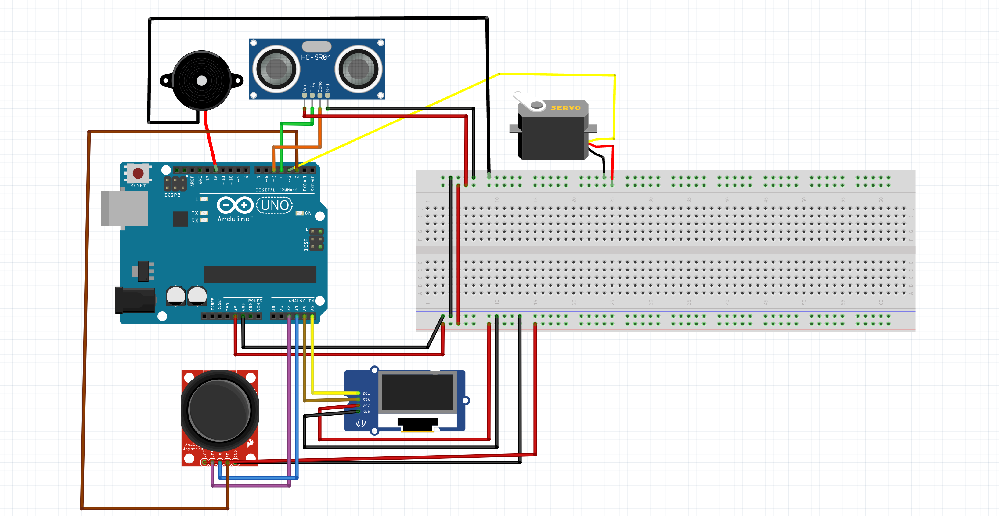

## How It Works
- The ultrasonic sensor measures distance to objects
- It it mounted to a servo motor that can be controlled with joystick input
- The OLED displays:
    - Current distance
    - Minimum and Maximum distances
    - Radar visualization
- The buzzer changes speed based on how close objects are

## Wiring

## Demo Video
https://youtu.be/N69RERCU6C0

## Future Improvements
- Automatic Radar Sweep
- Variable speed for radar rotation
- Smoother servo movement
- Better radar visuals

## Author
DJ Everidge